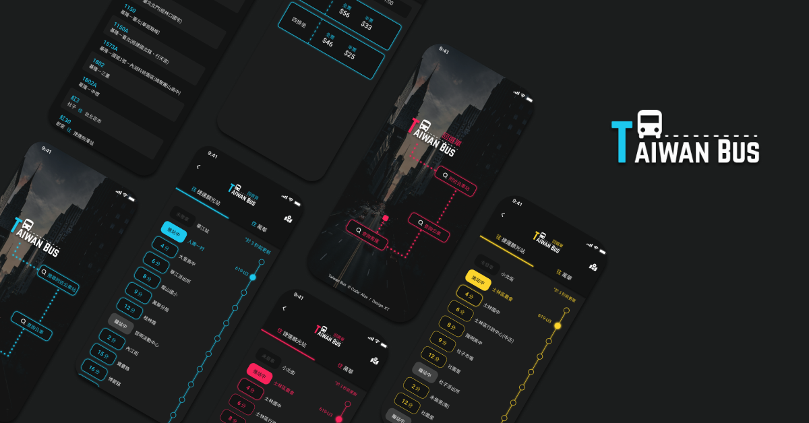
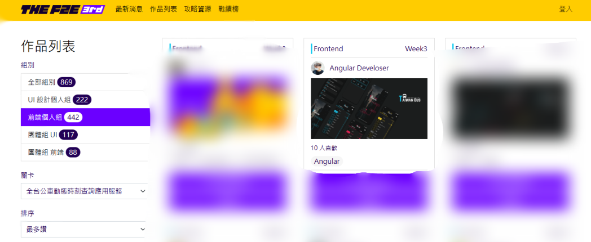

# BusApplication

---
 # 特別感謝：設計師[KT](https://2021.thef2e.com/users/6296432819610583177)


---
### 參賽名次

個人組 1615 人參賽，其中：
- 未得獎者：1605 人
- 得獎者：10 人 (0.62%)




---

### 作品說明
The F2E 全台公車動態時刻查詢應用服務

### 系統說明
**啟動方式**
```
$ npm install
```
```
$ ng serve -o
```

*注意: ng serve前 需要於.src下建立enviorment資料夾，其中.ts包含PTX APP KEY以及PTX APP ID*


### 主要資料夾說明
- home : 起始頁
- bus-inquire : 公車查詢
- near-station : 附近公車站
- inter-city-bus-inquire : 客運查詢
- service : 相關服務(如:http.get)

### 第三方服務
- PTX API
